# Group Project Report of the Team Only Hard

## Table of Contents

1. [Team Members and Roles](#team-members-and-roles)
2. [Conflict Resolution Protocol](#conflict-resolution-protocol)
3. [Application Description](#application-description)
4. [Application UML](#application-uml)
5. [Application Design and Decisions](#application-design-and-decisions)
6. [Summary of Known Errors and Bugs](#summary-of-known-errors-and-bugs)
7. [Testing Summary](#testing-summary)
8. [Implemented Features](#implemented-features)
9. [Team Meetings](#team-meetings)

## Team Members and Roles

| UID | Name | Role |
| :--- | :----: | ---: |
| u7212335 | Qinyu Zhao | Member |
| u7238607 | Xiangyu Hui | Member |
| u7189309 | Xuzeng He | Member |
| u7166251 | Yikai Ge | Member |

## Conflict Resolution Protocol

We learned a 5-step protocol on American Management Association.
*https://www.amanet.org/articles/the-five-steps-to-conflict-resolution/*
* Step 1: Define the source of the conflict.

* Step 2: Look beyond the incident.

* Step 3: Request solutions.

* Step 4: Identify solutions both disputants can support.

* Step 5: Agreement.

Examples of how we solved conflicts
1. *Background picture design*
    * Conflict: A colorful picture vs white picture
    * Result: Use white
    * Reason: The background picture changing in different versions and after discussion it would be better to stay in white and use the post pictures for a decoration and beautification.

2. *Data Storage*
    * Conflict: Storing data locally vs using Firebase
    * Result: Use Firebase
    * Reason: Storing files locally will become very cumbersome and complex, which will affect the loading speed of applications.

3. *Sliding mode*
    * Conflict: Vertical vs Horizontal
    * Result: Use Vertical sliding
    * Reason: The horizontal sliding operation interface will make many users unaccustomed and inconvenient for the display of posts with long content.

## Application Description

Programmer+ is a social communication application specifically targeting programmers. Programmer+ provides a social platform to realize the exclusive social communication between programmers,
which can form their own social circle and make the social circle more specialized. Programmer+ has the function of posting to realize the exchange of ideas and daily life between programmers. The private
message function allows programmers to have more in-depth communication, such as discussing some programming problems or new ideas. The official account of the software will hold some offline activities to achieve better communication between users. The long-term goal is to build this application into an exclusive research social platform for the computer area.

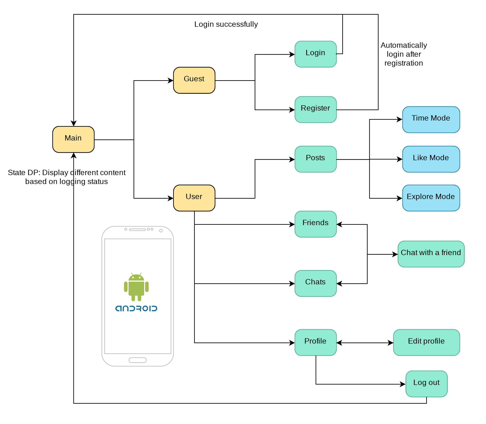

**Application Use Cases and or Examples**

Main Interface:

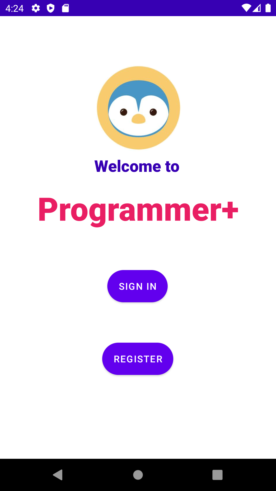

Targets Users: Programmers

* Guest:
  * create an account with a portrait image and intro

    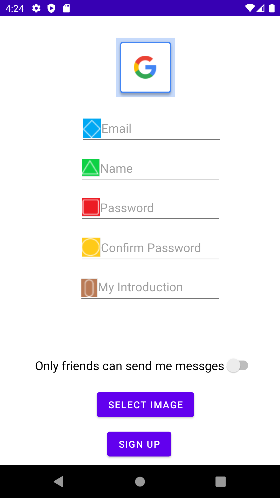
  
  * login using a correct email and password
  
    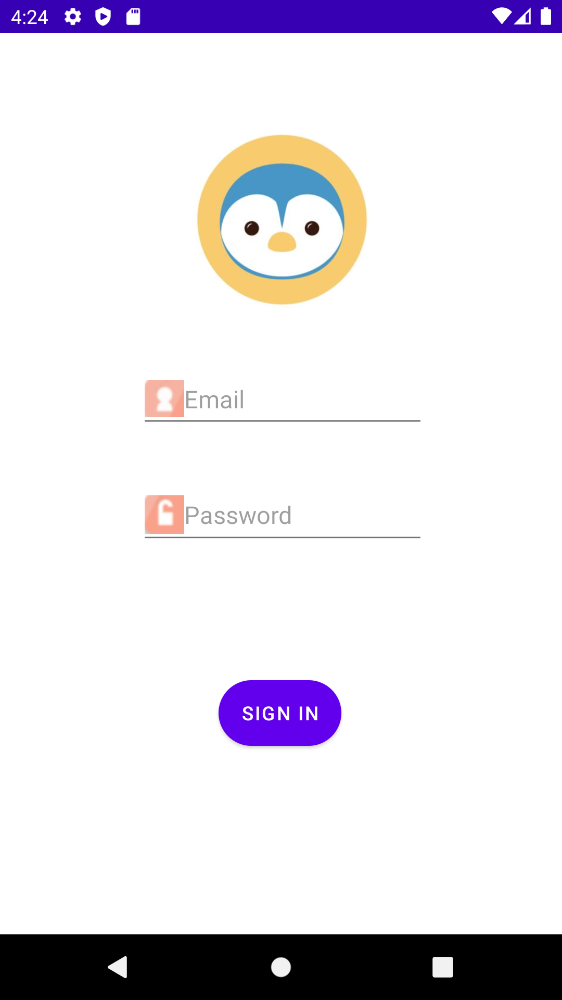
* Users
  * send a post with image, hashtag and GPS location
  
    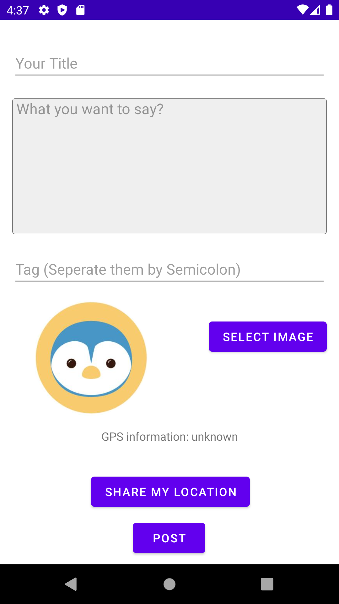
  
  * view personalized timeline of posts with image, hashtag and GPS location and without heat speech
  
    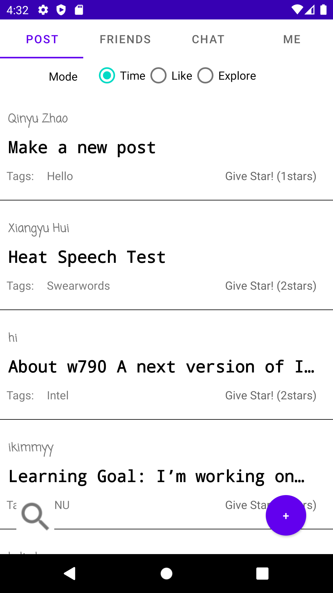
  
  * search the posts by tags, title, post id and author with partially valid queries
  
    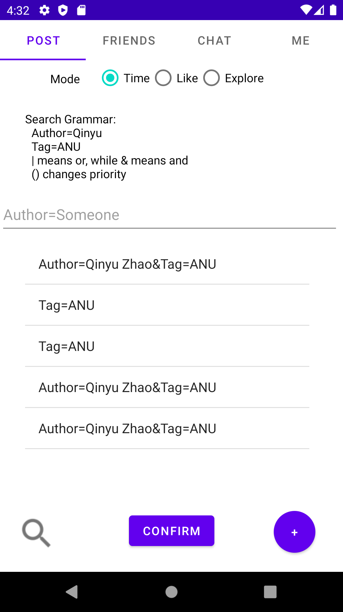
  
  * "like"(Give star) to others' posts
  
    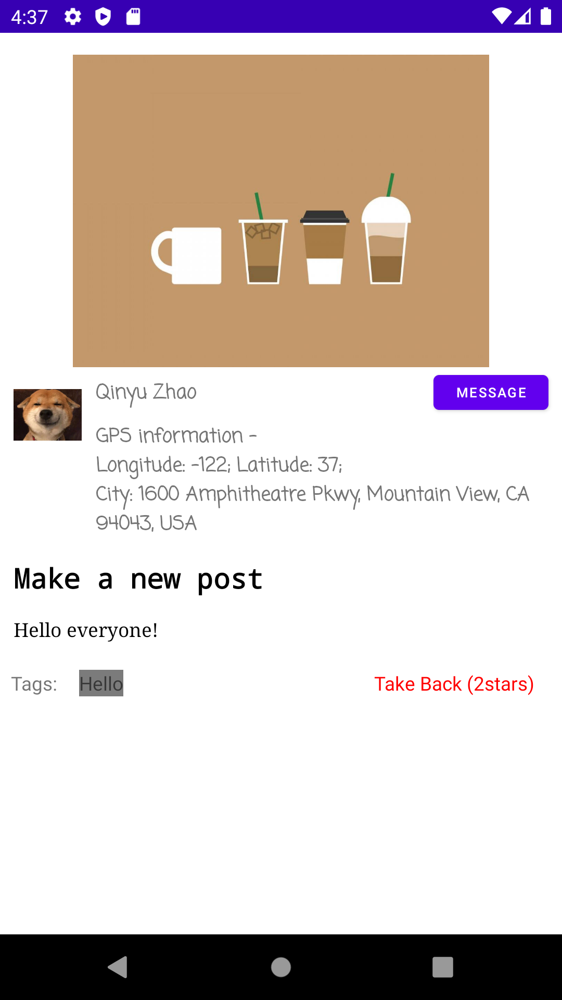
  
  * be notified when the post gets a like
  
  * send friend requests and become friends with other users
  
    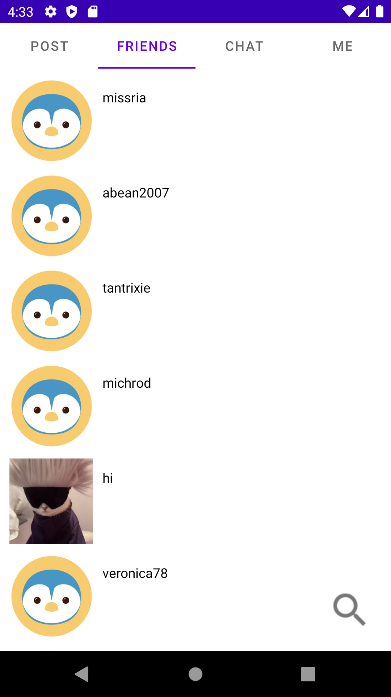
  
  * message other users
  
    
  
  * block other user from messaging
  
  * choose to only get message from a friend user
  
    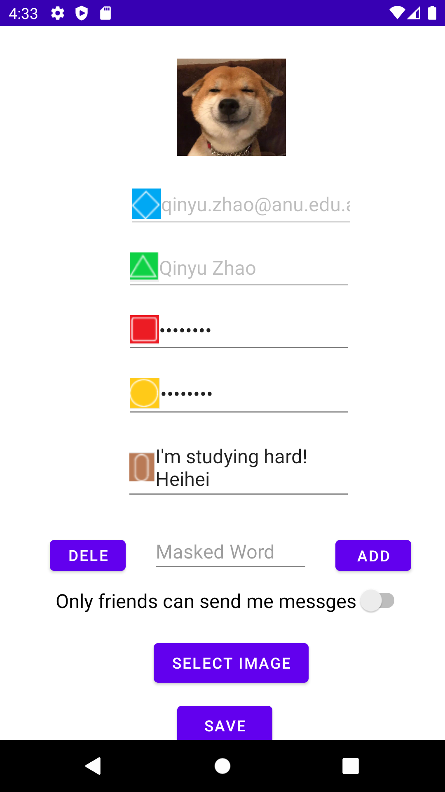
  
  * set template message
  
    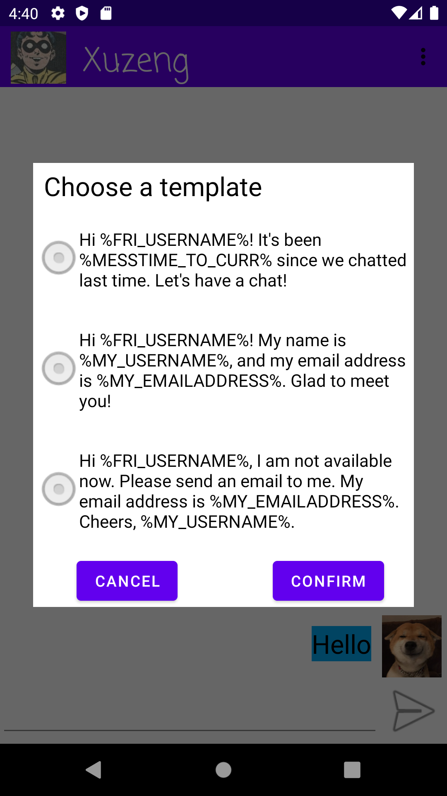


## Application UML


## Application Design and Decisions

**Data Structures**

Our team use the following data structures in our project.

1. AVL-Tree
   * Objective:
     * It is used for storing the swearwords for  surprise feature(iii) removing/hiding hate speech in posts;

     * We will search the stored swearwords to find out whether the target word is a swearword.

   * Locations:

     * Declared in *DataStructure\AVLTree.java* and used in *SwearWordsDAO.java* line *9*.
     * Used for removing hate speech in line *52* in *HateSpeechParser\Tokenizer.java*
     * Persistent data in *app\src\main\assets\swear_words.json*

   * Reasons:

     * Tree is easy to use *Gson* to read and store as persistent data(.json).
     * Compared with binary search tree AVL-Tree is close to balance tree, for look up with a time complexity *O(log(n))*
     * Compared with Red-Black Tree, the height of an AVL tree is bounded by roughly 1.44 * log2(n), while the height of  a red-black tree may be up to 2 * log2(n). Thus, lookup is slightly faster on the  average in AVL.
     * The distribution of swear-words is very biased (for example, many f-words but few z-words). It's not efficient to use a Hash-related structure.

2. HashMap
   * Objective: We store different key-value relations of a user, including id -> email, email -> id, and id -> username.

   * Locations: three instances of HashMaps are in util.UserManager

   * Reasons:
     * We usually want to find a user email or name based on his ID. It's not efficient to always search on Firebase, although that's possible.
     * HashMap gives a very quick method O(1) to find value given a key.

3. ArrayList
   * Objective: We store the friend list, the chat list, the message list in ArrayLists.

   * Locations: ChatsAdapter, FriendAdapter, and MessageAdapter under util.Adapter

   * Reasons:
     * If a user click one of his friend, then the chat interface will pop out. In this case, we need to directly find the friend according to his location in the name list. ArrayList is very useful because it supports O(1) random access, faster than LinkList.


**Design Patterns**


1. State

   * Objective: It is used for changing the main interface based on the session state.

   * Locations: Line 33 - 47 in MainActivity; All classes under the path util.State.

   * Reasons:

     * There could be two different states: session and no-session. The main interface should display different contents.

     * If we used an indicator in the MainActivity, the layout and functions would be combined in a complex way, and the code would be not easy to understand. So we choose the State DP

2. DAO

   * Objective: It is used for storing all kinds of data.

   * Locations: All classes under the path util.DAO.

   * Reasons:

     * We don't want UI classes directly handle data reading and writing.

     * It will be easier to change data store, for example, from storing data locally to using Firebase. We just need to re-write the DAO class, with other classes unchanged.

3. Singleton

   * Objective: It is used when we only need one instance.

   * Locations: All classes under the path util.DAO; the UserManager class; and the FirebaseRef class.

   * Reasons:

     * We only want one instance for each of these classes.


4. Strategy

   * Objective: It is used for displaying posts based on different priority.

   * Locations: All classes under the path util.TimelineCreation.

   * Reasons:

     * There will be different algorithms to sort and display posts, for example, according to time order, whether the user will like, and whether the user don't know and so on. A user may choose different modes to show posts for them, and our app can change accordingly.

     * In the future, we may add some other personalization algorithms. At that time, we only need to write a new child class to implement the algorithm. The Strategy DP makes the code easy to extend.

5. Factory

   * Objective: It is used for displaying generating different algorithms to display posts.

   * Locations: The CreatorFactory class under the path util.TimelineCreation.

   * Reasons:

     * There will be different algorithms to sort and display posts. So we create a factory to generate one of them.

**Grammars**

- Search Engine

Our search engine supports both intersection and union queries, and use () to apply precedence; At present most search engine only support intersection queries but not union quires like Firebase. 

For example, in our search engine we can do the following query:

```
(Tag=BotTalk|Tag=ANU)&Author=Qinyu Zhao
```

 This query will return all Qinyu Zhao's posts with tag containing BotTalk or with tag containing ANU

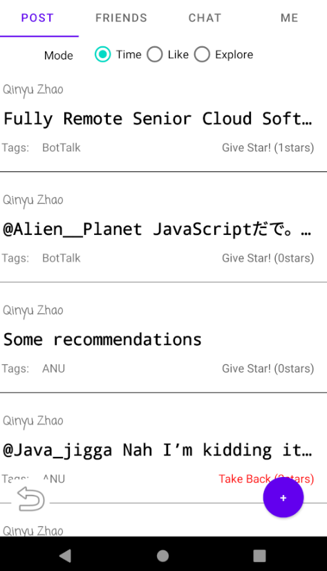

Moreover,our search engine also support partially valid and invalid search queries, when encounters an invalid section, it will toast a message indicating which section is invalid. After that, the search engine will search the neighbor section, and if the current section is a intersection query it will be casted to union query. For example, if we our query is "TTTT=aaa&Author=Qinyu Zhao" , the result will be all the posts that written by QInyu Zhao, even though there is a & in the syntax.


The Grammar Rule

- <query> :=  <query_unit>, { <operstors>,  <query_unit>} 
- <query_unit> := (<feild>,'=',<key>) | ( '(',<query_unit>, <operator>, <query_unit>, ')' )
- <field> := 'Author' |'Tag' | 'Title' | 'Id'
- <operator> := '&' | '|' 
- <key> := <string_value>

Punctuators: 

1. '&' represent take an intersection between two expressions

2. '|' represent take a union between two expressions
3. '=' used for conditional filtering 
4. '(' and ')' used for applying precedence

Notification

Our grammar is case sensitive, and spaces are not allowed in our grammar, as the authors' name and titles may contains space. And you are not allowed to include the punctuators in your search key.

Example

A correct syntax will looks like `((Title=A|Tag=B)&Author=C)|Id=a123`

**Tokenizer and Parsers**

- Tokenizer and Parsers used in search engine

  - Tokenizer

    Token: 

     Fields : [Title, Author, Tag, Id]

     Punctuators : [LBRA, RBRA]

    [Illegal] represent the current token is an invalid syntax for search

  - Parser 

    1. Parser grammar

    ```
    <exp>    ::= <term> | <term>&<exp> | <term>|<exp>
    <term>   ::=  <Post_List with key> | ( <exp> )
    ```

    - Node classes 

       public abstract class <font color=Purple>Exp</font>

       public class <font color=Purple>KeyExp</font> extends <font color=Purple>Exp</font> with <font color=Orange>field</font>, <font color=Orange>key</font> and a <font color=Purple>List<Post</font>> <font color=Orange>postlist</font> which satisfied the key ( for example, if the field is "Tag", key is "ANU", the post list will be all the posts of which tags contain "ANU" )

       public class <font color=Purple>AndExp</font> extends <font color=Purple>Exp</font> with <font color=Purple>Exp</font> attributes *<font color=Orange>term</font>* and <font color=Orange>exp</font>

       public class <font color=Purple>OrExp</font> extends <font color=Purple>Exp</font>  with  <font color=Purple>Exp</font> attributes *<font color=Orange>term</font>* and <font color=Orange>exp</font>

  - How does search parser work

    1st. We need to pass the query string in our Tokenizer.

    2nd. Pass the tokenizer into Parser, inside the parser, it will pop out the tokens and left recursively create expressions.

    3rd. After building up our final expression, we can use evaluate() to recursively get the result, in the AndExp the evaluate function will return the intersection of the term's list and exp's list, OrExp will return the union of these two list, KeyExp is the base case will just return the local list. 

  - Derivation for expression building 

    - Title=A|Tag=B&Author=C&Id=123

      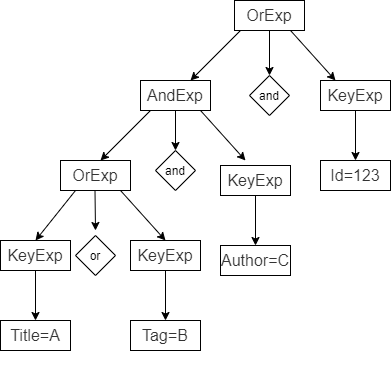

  - Derivation for expression executing 

    - Title=A|Tag=B&Author=C&Id=123

    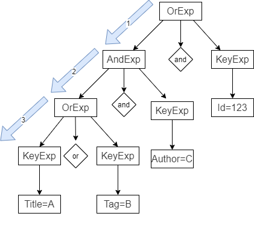


**Surprise Item**

Our group implement the (ii) and (iii) surprise items.

1. Surprise feature (ii)
      * Description: logging user activity to improve search results and/or timeline creation (simple personalisation);

      * We logged the latest location of each user (GPS information) and the posts a user like. Then we provide three modes to display posts (create timeline) - Time, like and explore

        * The time mode is just to display the 10 latest posts;
        * The like mode is to recommend posts that the user may like. We create a simple equation to calculate the distance of a user between others (the distance of their locations minus the ratio of posts they both like). And then, our app will recommend posts based on the closest other users.
        * The explore mode also needs to calculate the user distance. But this mode will recommend posts from the furthest users, in contrast to the like mode.

      * How does our app help the society? I think the most important feature is that we have three modes for a user to choose. 
        * If he just wants to see the latest posts, then he can choose the time mode;
        * If I'm on diet, I just want to see healthy lifestyle. I can choose the like mode. Then posts containing only healthy food and exercises will be recommended. *This is a hypothesis, not sure if our algorithm can actually do it.*
        * In case that our uses will have partial ideas and knowledge, we add the explore mode. In this mode, the users will learn something from the furthest users. That means they will some posts that they may not see in daily life.

2. Surprise feature (iii)
    * Description: removing/hiding hate speech in posts;

    * Method

        * We use tokenizer and parser to change content of a post. Swear words are hided like "****"
        * Swear words are stored in an AVL-tree for quick search.
        * A user can add or delete swear words by himself.

    * How does our app help the society?
        * Our application can hide swear words, maintaining a good community atmosphere.

**Other**

The number of data that we generated is much more than the project needs.
* Data generation
    * We uses twint on github (https://github.com/twintproject/twint) to get more than 10,000 posts from Twitter.
    * Then, we generated **500** users on Firebase
    * Posts were cleaned and added tags into. **10,000** posts were uploaded to Firebase
    * **10,000** pair of friends were generated
    * **10,000** stars were randomly distrbuted to those posts


## Summary of Known Errors and Bugs

1. *Bug 1:*

- Error when edit blank profile
- If the user did not full fill the name or other information in the register page, when the user login and want to change their information in the edit profile page the software will bow out with error.
  Normally, users would always fill all the blanks when they register their information. Also, we add some colorful logos on each blank input box to attract the user attention psychologically.


2. *Bug 2:*
- Can not give a star in search mode
- After searching, the user cannot give star to specific posts in list mode, but they could click the post and open the post page to give a star.
  We think normally user would be more likely to look for something important instead of just to give a star when they are using the search mode.
  Also, in search mode it would cause false contact give star when they are sliding in search mode and it seems absurd to give stars in the case of read-only titles.


## Testing Summary

Our Test test all utility classes that are not interacted with UI(activities) and Firebase. We didn't include Firebase tests is because when we interact with Firebase it will create another thread to communicate with the Online Server, and JUnit is not capable of doing concurrency programming test. When we test the classes which used Firebase JUnit will throw an exception.

- JUNIT Test 1. AVL-Tree Test

  In this test we have 3 sub-tests

  - Search Test: We tested whether the search function can return the correct result, when we search an exist element or non exist element.

  - Insert Test: After insertion, whether the AVL-Tree contains the added element. In addition the AVL-Tree should keep balance after insertion.
  - Remove Test: After deletion, whether we can still find the removed element in our Tree, and the AVL-Tree should keep balance after deletion.

  Test coverage:

  Our AVL-Tree Test covered 100% classes in Data Structure and 84% methods and 70% lines.

  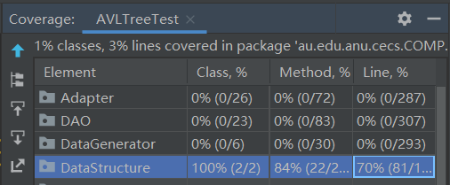

- JUNIT Test 2. Hate Speech Remove Test

  This test has 3 sub-tests

  - No Mask Test:  In this Test, we Tested whether the parser will mis-mask the sentence without heat speech.
  - Mask Test: In this Test, we Tested whether the parser can properly remove the swearword in the given sentence.
  - Long Sentence Test: Given a long sentence, whether the parser could remove the swear word precisely.

  Test Coverage:

  Our Hate Speech Remove Test covered 100% classes in HateSpeechParser and 90% methods and 90% lines.

  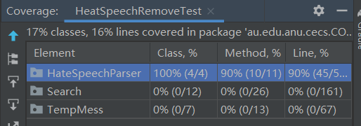

- JUNIT Test 3. Search Parser Test

  Our Search Parser' job is parse the request and processing the posts from Firebase; Therefore, we can only test the functionality of the evaluate method of Exp nodes.

  There are 3 sub-tests.

  - AndExp Test: Test whether AndExp can give the intersection of two lists.
  - OrExp Test: Test whether OrExp can give the union of two lists.
  - NonExp Test:  Test AndExp or OrExp which contains NonExp, whether it can give correct non empty list.

  Test Coverage:

  The Search Parser Test covered 100% Exp classes and 100% methods and 84% lines.

  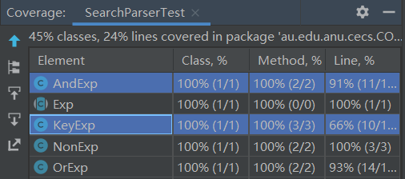

- JUNIT Test 4. Template Message Test

  Test whether the template message can be correctly converted to a actual message.
  
  Test Coverage:

  The TempMessageTest Test covered 100% of the three classes.

  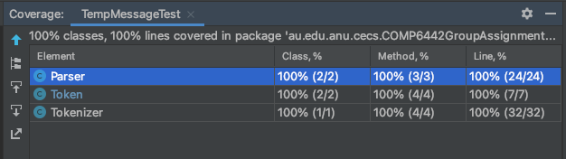


- UI Test 1. No session activity test

  Test whether the UI is displayed correctly when there is no session.

  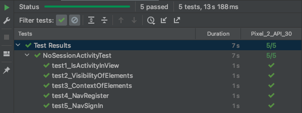

- UI Test 2. Register test

  Test whether the UI is displayed correctly when a guest is registering.

  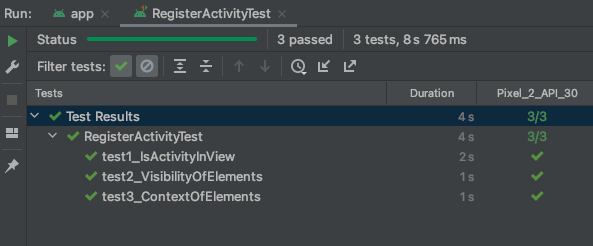

- UI Test 3. Session test

  Test whether the UI is displayed correctly when there is a session.

  

## Implemented Features

Improved Search

1. Search functionality can handle partially valid and invalid search queries. (medium)

Greater Data Usage, Handling and Sophistication

2. User profile activity containing a media file (image, animation (e.g. gif), video). (easy)
3. Use GPS information (see the demo presented by our tutors. For example, your app may use the latitude/longitude to show posts). (easy)
4. Deletion method of either a Red-Black Tree and or AVL tree data structure. The deletion of nodes must serve a purpose within your application (e.g. deleting posts). (hard)

User Privacy

1. Friendship. Users may send friend requests which are then accepted or denied. (easy)

User Interactivity

1. The ability to micro-interact with 'posts' (e.g. like, report, etc.) [stored in-memory]. (easy)

Peer to Peer Messaging

1. Provide users with the ability to message each other directly. (hard)

2. Privacy I: provide users with the ability to ‘block’ users. Preventing them from directly messaging them. (medium)

3. Privacy II: provide users with the ability to restrict who can message them by some association (e.g. a setting for: can only message me if we are friends). (hard)

4. Template messages or Macros (for peer to peer messaging or template posts (e.g. a quick one-tap post)). For example, "Hi %USERNAME%, I am not available now. Call to %PHONE_NUMBER% if it is urgent. Cheers, %MY_USERNAME%". The use of tokenizer and parser is mandatory. (hard)

Firebase Integration

1. Use Firebase to implement user Authentication/Authorisation. (easy)

2. Use Firebase to persist all data used in your app (this item replace the requirementto retrieve data from a local file) (medium)

3. Using Firebase or another remote database to store user posts and having a user’s timeline update as the remote database is updated without restarting the application. E.g. User A makes a post, user B on a separate instance of the application sees user A’s post appear on their timeline without restarting their application. (very hard)

Wattle Feature Forum

1. Use Machine Learning to recommend friends to a user (hard)


**In total:** 5 easy, 3 medium, and 6 hard features 


## Team Meetings

- *[Team Meeting 1](Meeting1.md)*
- *[Team Meeting 2](Meeting2.md)*
- *[Team Meeting 3](Meeting3.md)*
- *[Team Meeting 4](Meeting4.md)*


